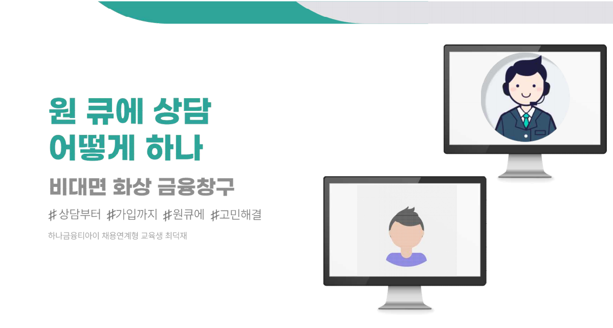
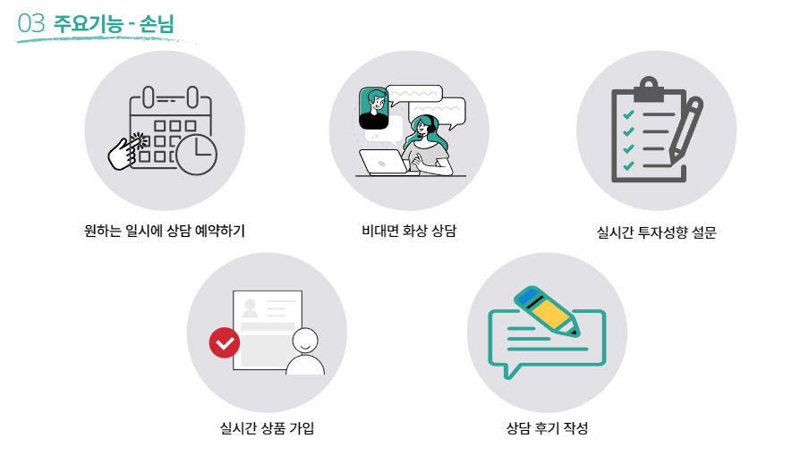
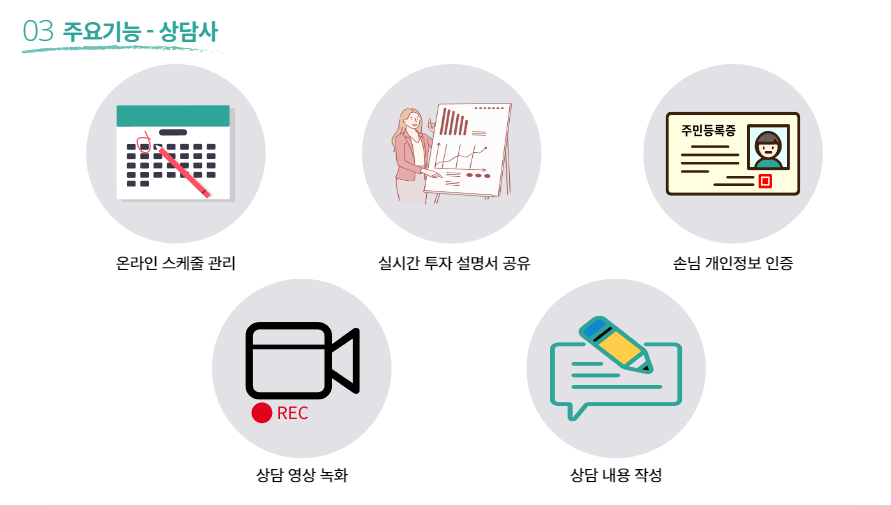
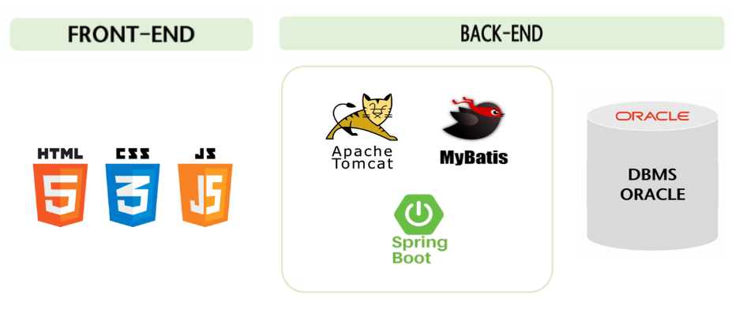
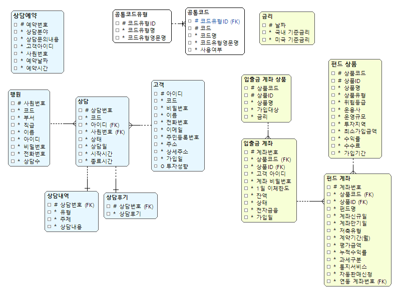

# 원큐에 상담 어떻게 하나

[프로젝트 홈페이지 - https://koposoftware.github.io/2022_16_djchoi/](https://koposoftware.github.io/2022_16_djchoi/)

# 1. 프로젝트 개요

### 프로젝트 개요
* 현재 금융권은 비대면ㆍ디지털 전환으로 인한 많은 지점들이 통폐합되고 있다.
* 웹을 활용한 비대면 상담 및 창구가 많이 없을 뿐만 아니라 있더라도 실질적인 금융서비스 이용 불가

### 프로젝트 목적
* 비대면 화상 창구 업무를 통한 비대면 채널 강화

 

# 2. 프로젝트 제안서
[프로젝트 제안서](/2260341022_최덕재_제안서.pdf) 
 
 

# 3. 프로젝트 결과

## 발표 ppt 
[발표자료](/최종ppt.pdf) 

## 시연 동영상 

  <iframe width="424" height="238" src="https://youtu.be/SjWqHlg7PG8" title="YouTube video player" frameborder="0" allow="accelerometer; autoplay; clipboard-write; encrypted-media; gyroscope; picture-in-picture" allowfullscreen></iframe>

# 4. 프로젝트 요약
### 프로젝트 기간 (2022-09-16 ~ 2022-10-25)

### 주요기능
<손님>
 

<상담사>
 

### 사용기술

 - spring을 활용한 웹 애플리케이션 제작
 - spring을 활용한 websocket 구성
 - websocket를 통한 실시간 데이터 전송
 - webRTC를 활용한 미디어 스트리밍
 - JavaMailSender, coolsms, ClovaOCR을 통한 본인 인증
 - HIGHCHARTS를 통한 데이터 시각화
 - FullCalendar를 통한 예약 일정 관리

### 개발환경

* OS : window10
* Language : Java(1.8), HTML, CSS, Jacascript
* Server : Apache Tomecat 9.0
* Framework : Spring, Mybatis, Bootstrap
* DB : Oracle19c
* Tool : STS, Sqldeveloper
* Etc : Git

### 시스템 아키텍쳐

 

### ERD

    

# 5. 본인 소개

본인 소개를 추가하세요

|이름 |최덕재||
|연락처 | 202260341022(@)kopo.ac.kr|
|skill set| Frontend - HTML, CSS, Javascript|
| | Backend - Java, Spring, Oracle|
|자격증| 2022년 SQLD |
|수상| 2022년 한국폴리텍대학 벤처창업아이템경진대회 입선 (고용노동부 후원)  |
| | 2022년 교내 프로젝트작품 경진대회 금상 수상|
|특기사항|  FIFAONLINE 수준급 실력 |
|| LeageOfLegends 8년째 꾸준히 노력 중  |

